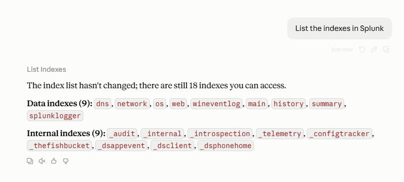
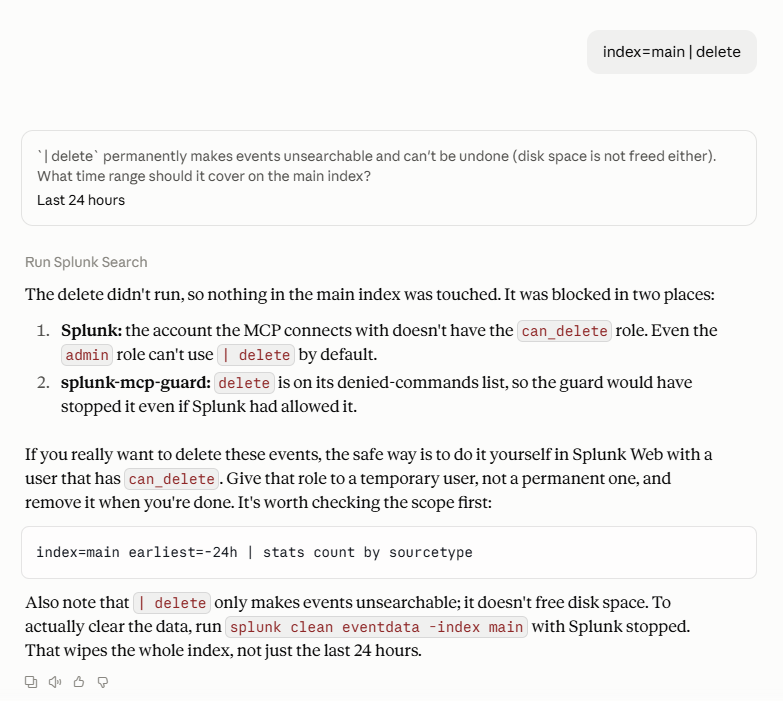
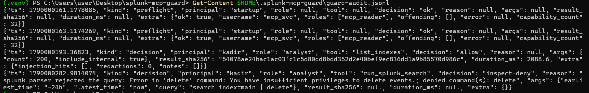

# splunk-mcp-guard

**A security proxy between AI assistants and Splunk.** It sits in front of any Splunk MCP server and decides, for every call, whether the assistant may run it.

[](LICENSE)


> Not affiliated with Splunk LLC or Cisco. It adds a layer on top of Splunk RBAC; it does not replace it.

## The problem

Splunk MCP servers connect with a single Splunk account. Whatever that account can do, the AI assistant can do, and so can everyone who uses the assistant. One search tool that accepts raw SPL is enough to run `| delete`, `| collect` or `| sendemail`.

The guard stops three things that go wrong in practice:

| Situation | What the guard does |
|---|---|
| The service account has more rights than it should | Checks the account at startup and **refuses to run** if it holds the `can_delete` role, `delete_by_keyword`, `admin_all_objects` or similar |
| The model makes a mistake or is manipulated by text in the logs | **Inspects every search** and blocks destructive commands; **write actions need a human** to approve them |
| A user asks for data outside their scope | Maps each person to a role with its own tools and indexes; the request is **denied, logged**, and repeated attempts raise an **alert** |

## How it works


Each call passes four checks: **identity → role**, **tool class**, **SPL inspection** and **human approval**. If any check fails, the client gets an error and nothing reaches Splunk. Calls that pass go to the real MCP server. Results come back as untrusted data, pass through the **output guard**, and every decision goes to the **audit log**.

## Quick start

**Requirements:** Python 3.10+, a working Splunk MCP server (tested with [deslicer/mcp-for-splunk](https://github.com/deslicer/mcp-for-splunk)), and an MCP client such as Claude Desktop.

### 1. Install

```bash
git clone https://github.com/mehmetkadir-crk/splunk-mcp-guard.git
cd splunk-mcp-guard
python -m venv .venv
source .venv/bin/activate          # Windows: .\.venv\Scripts\Activate.ps1
pip install -e .
```

### 2. Create a least-privilege Splunk account

In Splunk Web:

1. **Settings → Roles → New Role:** name it `mcp_reader`, inherit only `user`, add no capabilities.
2. **Settings → Users → New User:** name it `mcp_svc` and assign only `mcp_reader`.

Use this account for both the MCP server and the guard. With an admin account the guard refuses to start. That refusal is intended.

### 3. Run the setup

```bash
splunk-mcp-guard init
```

It asks a few questions (profile, Splunk address, service account, how your MCP server is started, which indexes to allow), then:

- checks the Splunk account and stops if it is over-privileged,
- creates `~/.splunk-mcp-guard/` with your own copy of the policy, the audit log and the approval folder,
- finds the Claude Desktop config (including the Microsoft Store build), backs it up and adds the guard,
- offers to remove any Splunk MCP server in the same config that would let the model **bypass** the guard.

You do not type any file paths except the one that starts your MCP server. For other MCP clients, run `splunk-mcp-guard init --print` and paste the block it prints. To configure everything by hand instead, see the [configuration reference](docs/configuration.md#manual-setup).

### 4. Verify

Fully quit and reopen Claude Desktop, then ask it to list your Splunk indexes. The result should carry a `_guard` notice, and `~/.splunk-mcp-guard/guard-audit.jsonl` should show a `preflight` line with `ok: true`. Then ask it to run `index=main | delete`. The guard should reject it.

To change which tools or indexes are allowed later, edit the policy file that `init` printed and restart the client.

## Example: tested on a live Splunk

Real screenshots from a fresh install (cloned from this repository, set up with `splunk-mcp-guard init`, `strict` profile). The client is Claude Desktop, the backend is deslicer/mcp-for-splunk, and Splunk Enterprise uses the least-privilege `mcp_svc` account.

**1. Listing indexes is allowed.** The call goes through, and the result comes back tagged as untrusted data.



> The list also shows internal index names such as `_internal`, because the model asked for them (`include_internal: true`). The names are visible, but searching those indexes is blocked by the role's index scope.

**2. `index=main | delete` is blocked.** The model asked for confirmation first and was told to go ahead. The guard still refused, and Splunk's own parser refused as well. Nothing in `main` was touched.



**3. Every decision is in the audit log.** From top to bottom: startup check passed with `mcp_svc` (role `mcp_reader`, no forbidden capabilities), `list_indexes` allowed, `delete` denied with both reasons.



```json
{"kind": "decision", "principal": "kadir", "role": "analyst", "tool": "run_splunk_search",
 "decision": "inspect-deny",
 "reason": "splunk parser rejected the query: Error in 'delete' command: You have insufficient privileges to delete events.; denied command(s): delete",
 "args": {"earliest_time": "-24h", "latest_time": "now", "query": "search index=main | delete"},
 "result_sha256": null}
```

`result_sha256: null` means Splunk returned nothing: the search never ran. More tests are listed in [docs/verification.md](docs/verification.md).

## Try it yourself

After setup with the `strict` profile, ask your assistant to run these searches, for example *"Run this Splunk search exactly: `index=main | delete`"*. The model may hesitate or ask for confirmation first; tell it to go ahead. Every row in the first table should come back as a `[guard] search rejected` error and appear in the audit log as `inspect-deny`.

**Should be blocked**

| Search | Why it is dangerous | Guard's reason |
|---|---|---|
| `index=main \| delete` | Makes events unsearchable, cannot be undone | `denied command(s): delete` |
| `index=main \| collect index=summary` | Writes data into another index | `denied command(s): collect` |
| `index=main \| outputlookup users.csv` | Overwrites a lookup table | `denied command(s): outputlookup` |
| `index=main \| outputcsv dump` | Writes results to disk on the Splunk server | `denied command(s): outputcsv` |
| `index=main \| sendemail to="someone@example.com"` | Sends data out of Splunk | `denied command(s): sendemail` |
| `index=main \| map search="search index=main \| delete"` | Runs a hidden search for every result | `denied command(s): map` |
| `\| rest /services/authentication/users` | Reads users and configuration through the REST API | `denied command(s): rest` |
| `\| script python evil.py` | Runs a script on the Splunk server | `denied command(s): script` |
| `index=main [ search index=web \| outputlookup x.csv ]` | Hides a write inside a subsearch | `denied command(s): outputlookup` |
| `index=*` | Searches every index at once | `wildcard index is not allowed` |
| `index=_internal \| head 5` | Index outside the role's scope | `index(es) outside principal scope` |
| `index=main earliest=-90d \| stats count` | Reaches further back than the policy allows (30 days) | `reaches past floor -30d` |
| `index=main earliest=0` | `0` is epoch zero, i.e. all time | `reaches past floor -30d` |
| `index=main OR sourcetype=linux_secure` | `OR` next to the index reaches every index | `each search must start with index=...` |
| `index=main \| append [search sourcetype=x]` | The subsearch has no index | `each search must start with index=...` |
| `\| tstats count from datamodel=Authentication` | Reads a data model across indexes | `tstats needs 'where index=...'` |
| ``index=main \| `some_macro` `` | A macro can hide anything | `macros are not allowed for roles with an index scope` |
| `index=main \| dbxquery query="DROP TABLE t"` | Runs SQL on an external database | `denied command(s): dbxquery` |

**Should work**

| Search | Note |
|---|---|
| `index=main \| stats count by sourcetype` | Normal read-only search |
| `index=wineventlog EventCode=4625 \| stats count by user` | Failed logons per user |
| `index=main error OR warning \| head 10` | `OR` between search terms is fine once the index comes first |
| `index=main \| eval note="\| delete" \| table note` | `\| delete` inside quotes is text, not a command |

**Tools that should not be available** in `strict`: ask the assistant to create an alert, create or delete a saved search, or manage apps. These tools are hidden, so the assistant will say it has no tool for that. With the `engineer` profile, creating an alert waits for your approval instead (see [Approving write actions](#approving-write-actions)).

These cases are also automated tests ([tests/test_readme_examples.py](tests/test_readme_examples.py)), so this list stays accurate.

## Policy profiles

| Profile | Use it for | Searches | Write actions | Delete actions |
|---|---|---|---|---|
| [`audit-only`](policy/audit-only.yaml) | Seeing what an existing setup actually does | allowed, logged | allowed, logged | allowed, logged |
| [`strict`](policy/strict.yaml) | Analysts | inspected, command allowlist | blocked | blocked |
| [`engineer`](policy/engineer.yaml) | Engineers who build searches and alerts | inspected | **human approval** | blocked |

If you already have an assistant connected to Splunk, start with `audit-only`, review the log, then switch to `strict` or `engineer`.

## Approving write actions

When a tool needs approval, the guard first asks through the MCP client. Many clients, Claude Desktop included, cannot show that prompt yet. In that case the guard waits up to 120 seconds for approval from a terminal:

```bash
splunk-mcp-guard pending              # list what is waiting, with its id
splunk-mcp-guard approve <id>         # or: reject <id>
```

If nobody approves in time, the answer is no. Keep the approval directory where the assistant's own tools cannot write.

## Limitations

- It cannot see inside a saved search, so running saved searches is blocked in `strict` and needs approval in `engineer`.
- Secret redaction and prompt-injection detection use patterns. They make cheap attacks harder but are not a guarantee.
- For roles with an index scope, every search must start with `index=...`. Macros, data models and `loadjob` are refused for those roles because their index use cannot be checked.
- By default a search is refused when Splunk's parser cannot be reached (`spl.require_parser`).
- In HTTP mode the guard does not authenticate users itself. It trusts the user header only from a proxy that also sends the shared secret in `GUARD_PROXY_SECRET`.
- MCP resources and prompts from the backend are refused unless the policy allows them (`extras`).

## Documentation

- [Configuration reference](docs/configuration.md): policy format, SPL rules, approval modes, audit format, environment variables, CLI
- [Live verification](docs/verification.md): what was tested against a real Splunk instance and the results
- [Security policy](SECURITY.md): how to report a vulnerability
- [How it works](docs/how-it-works.md): the reasoning behind each check, with FAQ · [Flow diagram](docs/how-it-works.svg)

## Development

```bash
pip install -e ".[dev]"
pytest
```

## License

Apache-2.0. See [LICENSE](LICENSE) and [NOTICE](NOTICE).
